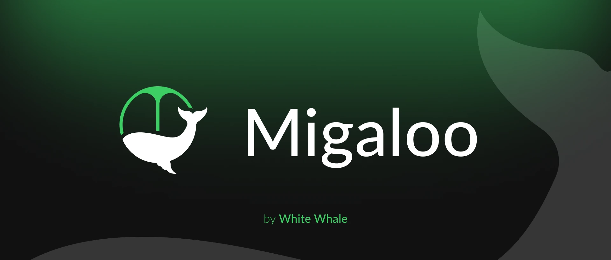

[![Twitter handle][]][Twitter badge]
[![Discord badge][]][Discord invite]

[Discord invite]: https://discord.com/invite/tSxyyCWgYX
[Discord badge]: https://img.shields.io/discord/908044702794801233
[Twitter handle]: https://img.shields.io/twitter/follow/Migaloo_Zone.svg?style=social&label=Follow
[Twitter badge]: https://twitter.com/intent/follow?screen_name=Migaloo_Zone

# Migaloo Docs
This repository contains information about the permissionless Migaloo Zone.

## Resources
1. [Website](https://migaloo.zone/)
2. [Discord](https://discord.com/invite/tSxyyCWgYX)
3. [Twitter](https://twitter.com/Migaloo_Zone)

## Contributing

[Code of Conduct](./docs/CODE_OF_CONDUCT.md)

[License](./LICENSE)
